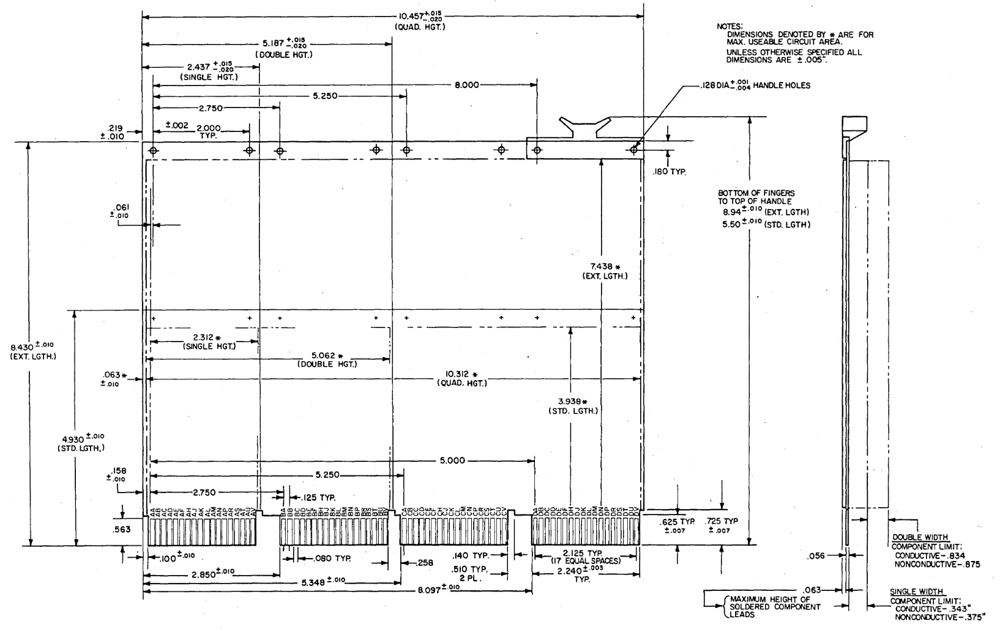
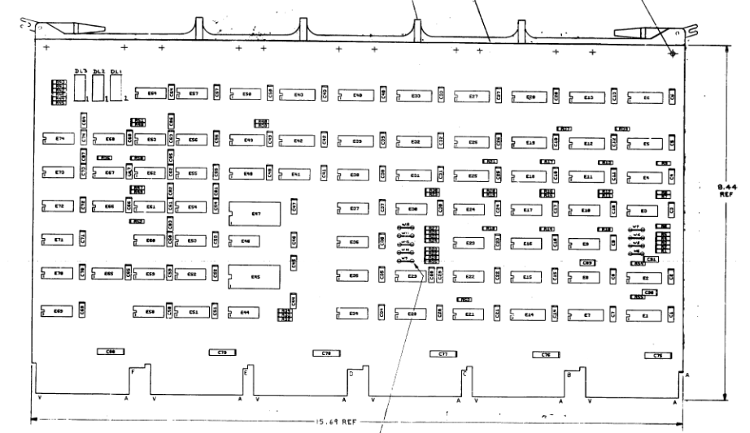
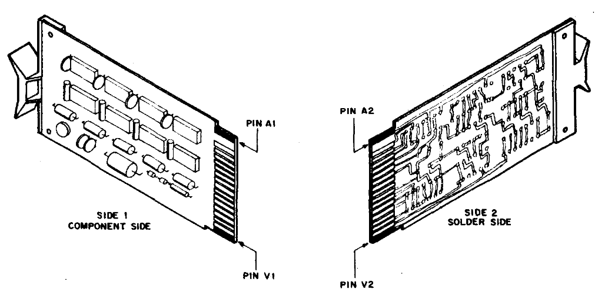
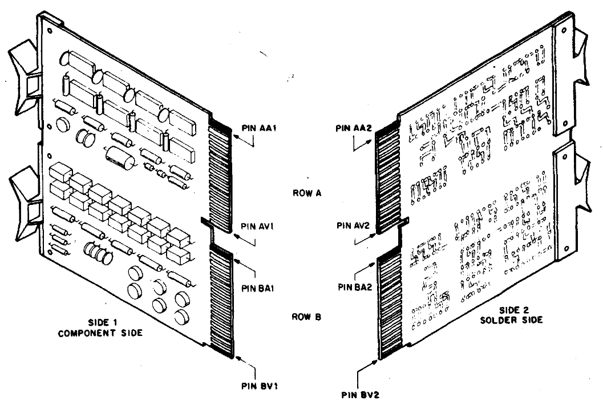
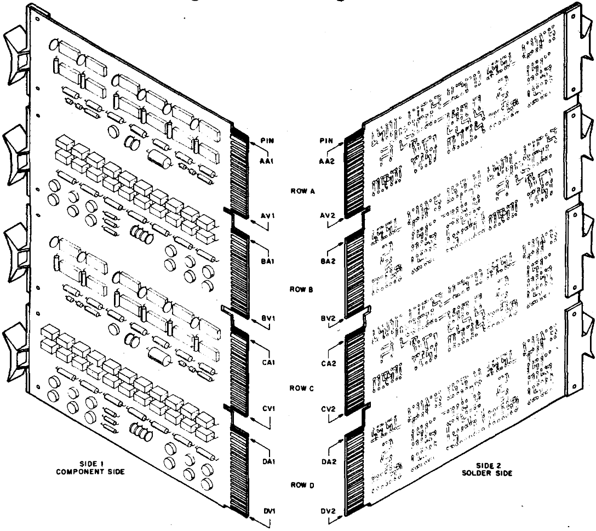
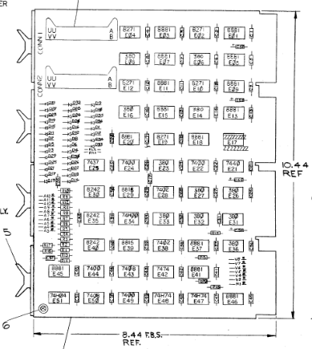

# DECbox
Blueprints and requirements for a box used to store DEC flipchips

## Examples

Overall dimensions for single, dual and quad cards:

Overall dimesions for example Hex card (DH-11)

Perspective views:

Example Quad card (DR-11):

## Hard requirements

The box must:
1. fit DEC Hex wide cards lengthwise
2. fit DEC Quad wide cards along the breadth
3. cover the full height of the cards with handles
4. support the cards along the edge connecter
5. handle the weight of a full box of either quad or hex cards without deforming
6. avoid contact with the components of the cards
7. avoid interference between cards
8. avoid binding between the box and cards
9. have tight enough tolerance to avoid rattling

## Soft requirements

The box may:
1. accept sandwiched cards (such as the UNIBUS M9202 backplane connector)
2. have receptacle for "claw" to fasten boards that have them
3. lid that mates with board top edge without putting undue pressure on them
4. be stackable
5. have handles
6. allow dividers that creates room for dual and single width cards
7. be easy to assemble from a "flat" packaging

## References

DR-11 Engineering drawings (has dimensions for QUAD card on page six): 

http://www.bitsavers.org/pdf/dec/unibus/DR11-C_EngrDrws.pdf

DH-11 Engineering drawings (has dimensions for HEX card on page seven): 

http://www.bitsavers.org/pdf/dec/unibus/DH11_EngrDrws_Jul76.pdf

Module dimensions and perspective drawings (pages 21-24)

http://www.bitsavers.org/pdf/dec/handbooks/Digital_Logic_Handbook_1975-76.pdf
